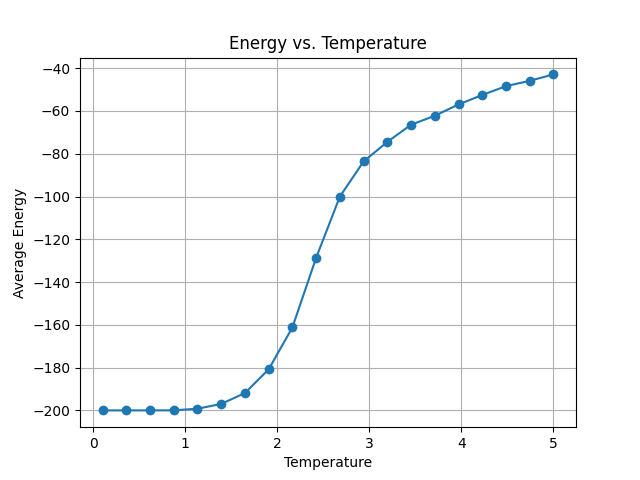
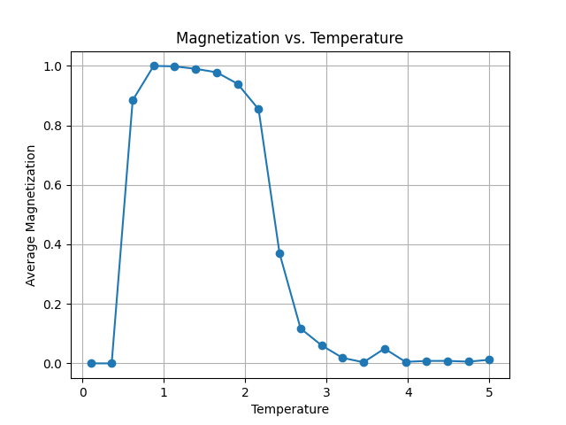
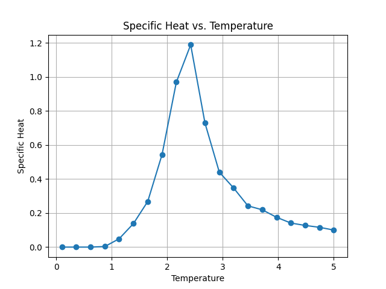
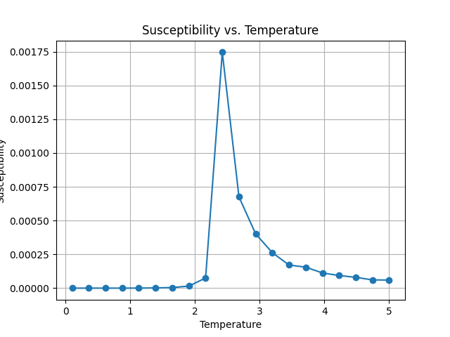
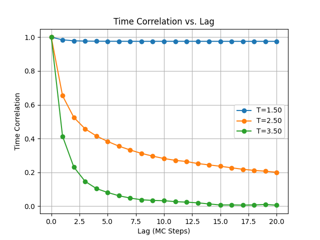
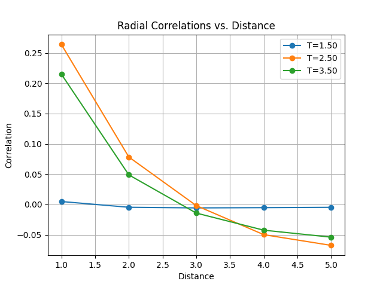

# Ising Simulation

```ts
import { reshapeArray, arrayToTidyData } from './components/utils.js';
import { Simulation } from './components/simulation.js';
```

```ts
const data = {
  temperature_energy: await FileAttachment('./data/temperature_energy.json').json(),
  temperature_magnetization: await FileAttachment('./data/temperature_magnetization.json').json(),
  specific_heat: await FileAttachment('./data/specific_heat.json').json(),
  susceptibility: await FileAttachment('./data/susceptibility.json').json(),
  correlations: await FileAttachment('./data/correlations.json').json(),
}
```


<div class="grid grid-cols-2"><div>

```ts
const [temperature, interactionStrength] = [
  view(Inputs.range([0, 5], { value: 1, label: "Temperature", step: 0.1 })),
  view(Inputs.range([0, 5], { value: 1, label: "Interaction Strength", step: 0.1 }))
];
```

```ts
const simulation = new Simulation({ gridSize: 10, temperature, interactionStrength });

const runningSimulation = (function* () {
  for (let i = 0; i<1000; ++i) {
    simulation.update();
    yield {i, simulation};
  }
})();
```

```ts
display(runningSimulation.simulation.getPlots()[0]);
```

</div><div>


- **Lattice**: The system is composed of a lattice of sites (e.g., a 1D line, 2D grid, or 3D cube), where each site holds a spin \( s_i \).
- **Spin States**: Each spin \( s_i \) can take one of two values: \(+1\) (spin up) or \(-1\) (spin down).
- **Interactions**: Neighboring spins interact with each other, with the interaction energy described by the Hamiltonian:

```tex
  H = -J \sum_{\langle i,j \rangle} s_i s_j - h \sum_i s_i
```

- ${tex`J`}: Interaction strength between spins.
- ${tex`\langle i, j \rangle`}: Sum over pairs of neighboring spins.
- ${tex`h`}: External magnetic field applied to the system.

The goal is to study how these spins arrange themselves to minimize energy (at low temperatures) or how they behave statistically at higher temperatures, __in our simulation there is no external field__.

**Description:** Blue (+1) and red (-1) cells show spin configurations. Low temperatures reveal stable clusters, while high temperatures produce random patterns.


</div></div>

---

<div class="grid grid-cols-2"><div>

```ts
display(runningSimulation.simulation.getPlots()[1]);
```

</div><div>

## Hamiltonian Plot

**Key Observations:** Energy decreases sharply initially, stabilizing at equilibrium. High fluctuations suggest transitions.

</div></div>


---

<div class="grid grid-cols-2"><div>


```ts
display(runningSimulation.simulation.getPlots()[2]);
```


</div><div>

## Magnetization Plot

**Key Observations:** At low temperatures, magnetization stabilizes around high values (aligned spins). At high temperatures, it fluctuates near zero due to randomness.

</div></div>

---

<div class="grid grid-cols-2"><div>




</div><div>

## Temperature vs. Energy
- **Low Temp:** Spins align, minimizing energy.  
- **High Temp:** Energy plateaus as spins randomize.  
- **Critical Temp:** Sharp rise near Tc indicates phase transition.


</div></div>

---

<div class="grid grid-cols-2"><div>



</div><div>

## Temperature vs. Magnetization

- **Low Temp:** Strong spin alignment yields high |M|.  
- **High Temp:** Randomized spins result in M ≈ 0.  
- **Critical Temp:** Magnetization declines steeply near Tc.

</div></div>

---

<div class="grid grid-cols-2"><div>



</div><div>

## Specific Heat
- **Low/High Temp:** Minimal specific heat.  
- **Critical Temp:** Sharp peak due to energy fluctuations.

Specific heat measures how the system's internal energy changes with temperature. It's a thermodynamic property that gives insight into the energy fluctuations of the system. Mathematically, specific heat is computed from the variance of the system's energy.

</div></div>


---

<div class="grid grid-cols-2"><div>



</div><div>

## Susceptibility
- **Low/High Temp:** Low susceptibility (ordered/disordered states).  
- **Critical Temp:** Large peak shows enhanced response to external fields.

This measures how sensitive the magnetization is to temperature.

</div></div>

---

<div class="grid grid-cols-2"><div>



</div><div>

## Dynamic Correlations

- __Low Temperatures (T < Tc):__ Correlation decays slowly, indicating ordered spins (ferromagnetic phase). The system retains memory over many Monte Carlo steps.
- __High Temperatures (T > Tc):__ Correlation decays quickly due to spin disorder (paramagnetic phase). The system loses memory rapidly.
- __Critical Temperature (T ≈ Tc):__ Correlation decays slower than at high temperatures but faster than at low temperatures, showing critical slowing down and long-range fluctuations.

The graph’s decay trend and rate reveal how spins retain memory, with slower decay near TcTc​ indicating critical phenomena.

</div></div>

---

<div class="grid grid-cols-2"><div>



</div><div>

## Spatial Correlations

__Low Temperatures (T < Tc):__
Spins are highly ordered (ferromagnetic phase), leading to strong correlations that start near 1 and decay slowly over long distances, indicating long-range order.

__Near Critical Temperature (T ≈ Tc):__
Correlations decay more slowly due to critical fluctuations and scale invariance. The correlation length diverges, potentially spanning the entire system as order transitions to disorder.

__High Temperatures (T > Tc):__
Spins become uncorrelated (paramagnetic phase), with correlations decaying rapidly to zero. Only short-range order remains due to dominant thermal noise.

__Expected Features:__
At low T, the correlation curve starts near 1 and decays slowly. At high T, it starts lower and decays quickly. As T increases, decay becomes progressively faster across curves.

</div></div>